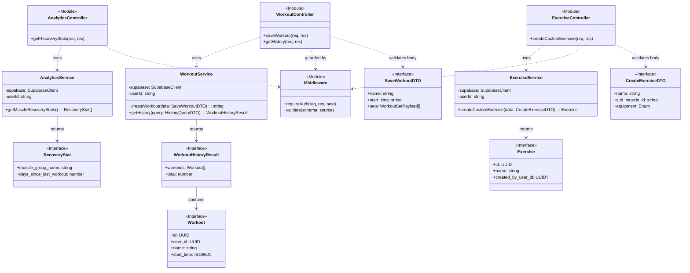

# Reps.io - Backend Documentation
**Version:** 1.0.0<br/>
**Stack:** Node.js, Express, TypeScript, Supabase (Auth & DB), Zod.<br/>
**Contents:**
1. [Overview](#overview)
2. [Project Structure](#project-structure)
3. [System Architecture](#system-architecture)
4. [Setup & Installation](#setup--installation)
5. [API Documentation](#api-documentation)

## Overview
Reps.io adopts a hybrid approach when dealing with data transfer, where simple read queries are directly sent to the database while heavy logic and write queries are handled by the backend.

The backend acts as a proxy. It receives the User's JWT, validates it, and creates a scoped connection to the database. This ensures that Row Level Security (RLS) policies defined in Supabase are strictly enforced, even for server-side operations.

## Project Structure
```
/src
  /config         # Supabase Client configuration (Scoped)
  /controllers    # Orchestrate HTTP flow (request -> service -> response)
  /middleware     # Auth verification and data Validation
  /routes         # API Endpoint definitions
  /schemas        # Zod Validation Schemas (Input DTOs)
  /services       # Business Logic & Database Calls
  /types          # TypeScript Interfaces (Domain Entities & Responses)
  app.ts          # Entry Point & CORS Setup
```

## System Architecture
The codebase follows strict SOLID principles as closely as possible, specifically the Single Responsibility Principle.


## Setup & Installation
Prerequisites:
- Node.js (v18+)
- A database (Supabase used currently) with setup.sql applied.

### 1. Install Dependencies
`npm install`
### 2. Environment Variables
Create a `.env` file in the root folder with the following:
```
PORT=3000
SUPABASE_URL=YOUR_SUPABASE_URL
SUPABASE_PUBLISHABLE_KEY=YOUR_SUPABASE_PUBLISHABLE_KEY
FRONTEND_URL=http://localhost:5173
```
*Note: The frontend URL is specified here for configuration of CORS security*
### 3. Running the Server
**Development**
```
npm run dev
```
**Production**
```
npm run build
npm start
```

## API Documentation
**Base URL**: `/api`<br/>
**Headers**: `Authorization: Bearer <SUPABASE_JWT>`<br>
**Routes**:

| Service | Route |
| -- | -- |
| **Workout** | [[GET] /workouts/history](#1-get-workoutshistory) |
| | [[POST] /workouts/finish](#2-post-workoutsfinish) |
| **Exercises** | [[POST] /exercises/custom](#1-post-exercisescustom) |
| **Analytics** | [[GET] /analytics/recovery](#1-get-analyticsrecovery) |

### Workouts
---
#### 1. `[GET] /workouts/history`
Get paginated past workouts.

Input:
| Key | Type | Notes |
| --- | --- | --- |
| page | number | Posititve integer |
| limit | number | Integer max 100, default 10 |

Output:
```
{
    success: boolean, (true for HTTP 200)
    page: number,
    limit: number, 
    total: number,
    data: [
        {
            id: UUID,
            user_id: UUID,
            name: string,
            start_time: ISO8601,
            end_time?: ISO8601,
            notes? : string
        }
    ]
}
```
---
#### 2. `[POST] /workouts/finish`
Save a completed workout session.

Input:
```
{
    name: string,
    start_time: ISO8061,
    end_time: ISO8061,
    notes: string, (Max 500 char)
    sets: [
        {
            exercise_id: UUID,
            set_order: number,
            weight_kg: number,
            reps: number
        }
    ] (Min 1 set)
}
```

Output:
```
{
    success: boolean,
    workout_id: UUID
}
```

### Exercises
---
#### 1. `[POST] /exercises/custom`
Create a user-specific exercise.

Input:
```
{
    name: string (1 to 100 chars),
    sub_muscle_id: string (e.g. lower_chest),
    equipment: string
}

Equipment must be one of the following:
'Dumbbell', 'Barbell', 'Ez-Bar', 'Machine','Cable', 'Bodyweight', 'Smith Machine', 'Other'
```
Output:
```
{
    success: boolean,
    exercise: {
        id: UUID,
        sub_muscle_id: string,
        name: string,
        equipment: string,
        created_by_user_id: UUID,
        created_at: ISO8061
    }
}
```


### Analytics
---
#### 1. `[GET] /analytics/recovery`
Get muscle recovery status.

Input: NA

Output:
```
{
    success: boolean,
    data: [
        {
            user_id: UUID,
            muscle_group_id: UUID,
            muscle_group_name: string,
            last_worked_at: ISO8061,
            days_since_last_workout: number
        }
    ]
}
```
