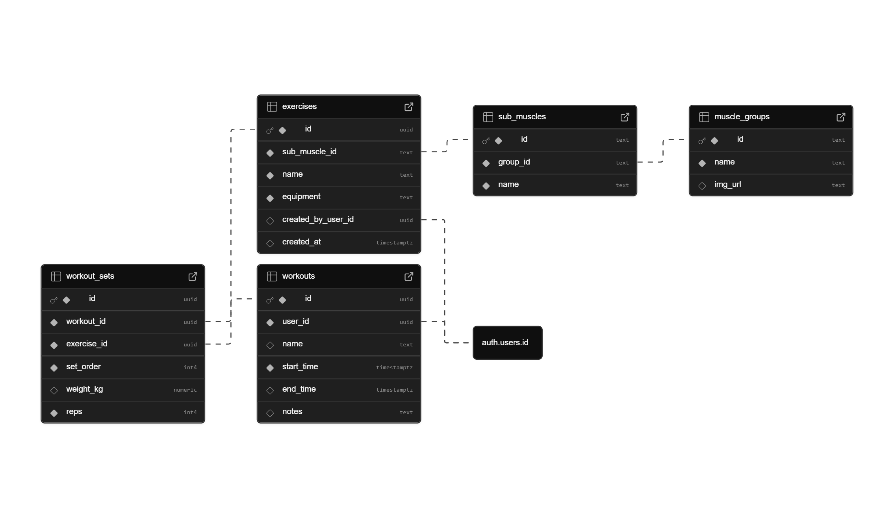

# Reps.io - Database Documentation
---
Version: 1.0.0 
Engine: PostgreSQL 17.6.1.063 (Hosted via Supabase) 
Architecture: Single-Table Multi-Tenant with Row Level Security (RLS)

## Overview
---
The Reps.io database handles user authentication, static reference data, and user-generated workout logs. Exercises are categorized based on their muscle group (eg. chest/ back/ arms) as well as their sub-muscle group (eg. upper chest/ lats/ biceps). The database also supports user created exercises.

## Entity Relationship Diagram (ERD)
---

## Special Notes
---
### 1. Core Tables
Tables are split into Reference, Hybrid and Transactional Data

| Reference Data (Static)  | Hybrid Data (Static & User) | Transactional Data (User) |
| ------------- | ------------- | ------------- |
| `muscle_groups`  | `exercises`  | `workouts` | 
| `sub_muscles`  | | `workout_sets` | 

This distinction is necessary to enforce strict **Row Level Security (RLS)**, improving data security.

| Table	| Policy Logic |
| ---- | ---- |
| `muscle_groups` `sub_musclegroups` | *Public Read*: Accessible by anyone (authenticated or anon). |
| `exercises` | *Hybrid Read*: Users see rows where created_by_user_id is NULL OR matches their UID. |
| `workouts` | *Private*: Users can only SELECT/INSERT/UPDATE rows matching their UID. |
| `workout_sets` | *Inherited*: Users can only modify sets if the parent workout_id belongs to them. |

### 2. Analytics & Views
`v_muscle_recovery`
A virtual table allows the quick look up of the last time a muscle group was worked (e.g., "Legs - Last worked 3 days ago").
*Please refer to [setup.sql](./scripts/setup.sql) for implementation*